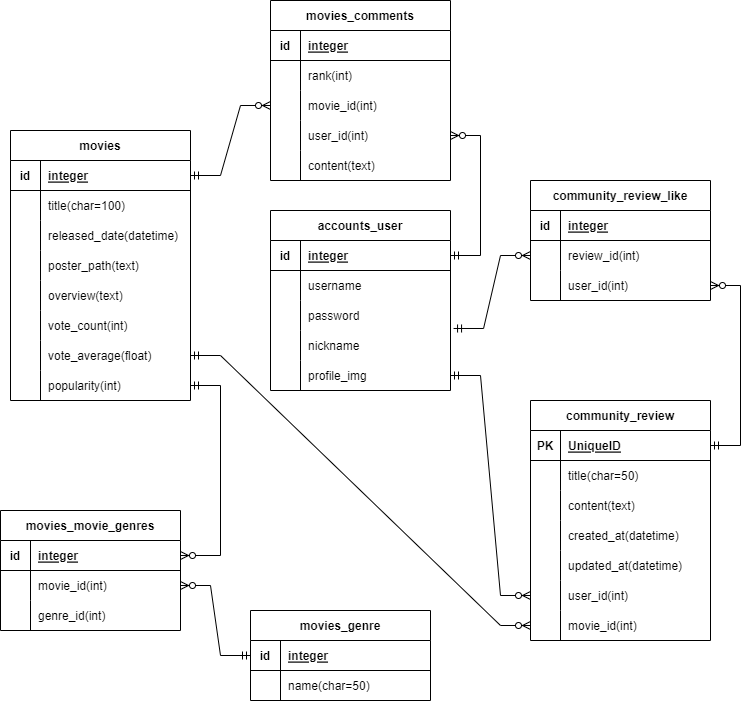

# 관통 프로젝트(MJYC)

> 21.05.20 - 21.05.26
>
> 김민지, 이주영, 최영찬

https://mjyc.herokuapp.com/

## 팀원 정보 및 업무 분담 내역

- 프론트: 이주영
- 백: 최영찬, 김민지

## 목표 서비스 구현 및 실제 구현 정도

- home화면의 인기영화에 유저들이 누른 좋아요가 많은 순서대로 보일 수 있게 구성하였다
- 홈 화면에서는 유저들이 좋아요를 많이 누른 순서대로 인기영화 목록에 보여지고, 현재 상영중인 영화, TVshow, 개봉 예정 영화들의 목록을 볼 수 있다. 옆으로 넘기면서 목록을 확인할 수 있도록 했다.
- 기본적으로 현재상영중인 영화를 db에 저장해놓고, 검색창에 검색한 후 영화의 포스터를 클릭 -> db에 저장되어 있지 않은 영화일 경우 tmdb에서 상세정보를 불러와서 db에 저장되고, 해당 영화의 상세 정보를 볼 수 있음 ->db에 저장되어 있는 경우 tmdb에서 불러올 필요가 없으므로 db에 저장되어 있는 해당 영화의 상세 정보를 볼 수 있도록 했음(미리 저장한 영화 말고도 tmdb에서 새로운 영화 불러와서 db에 저장할 수 있도록)
- 영화 상세페이지에서 별점과 한줄평을 달 수 있다.
- 커뮤니티에서 리뷰글, 댓글을 자유롭게 작성할 수 있다.
- 프로필 페이지에서 내가 작성한 게시글, 내가 좋아요한 영화의 목록을 확인할 수 있고, 나와 좋아하는 영화의 개수가 가장 많이 겹치는 이성 유저의 프로필을 확인할 수 있다. -> 다른 유저의 프로필에서 해당 유저가 좋아요 누른 영화 등을 확인할 수 있다.

## 데이터베이스 모델링 (ERD)

- 영화 상세 페이지에서 유저가 한줄평을 작성할 수 있고, 커뮤니티에서 리뷰도 작성할 수 있도록 하기 위해 User모델을 영화코멘트 모델과 커뮤니티 관련 모델에 연결하였습니다.

## 필수 기능에 대한 설명

- Home
  - 인기영화, 현재상영작, TV Show,  개봉 예정 영화들의 목록을 볼 수 있다.
  - 화살표로 넘기면서 목록들을 확인할 수 있다.
  - 반응형 페이지로 만들어서 화면 크기에 따라 영화 목록 넘기는 횟수가 달라진다.
  - nav-bar에 검색창이 있고, 영화를 검색할 수 있다.
  - 프로필 사진을 누르면 나의 프로필 페이지로 이동할 수 있다.
  - 영화 포스터에 마우스를 올리면 포스터가 커지는 효과가 나타나도록 했다.
- Community
  - 유저들이 작성한 리뷰 목록을 볼 수 있다.
  - 리뷰 작성버튼을 눌러 리뷰를 작성할 수 있다.
  - 리뷰 목록을 클릭하면 해당 리뷰의 상세페이지로 이동한다.
  - 리뷰의 상세페이지에서 댓글과 좋아요를 달 수 있고, 댓글은 삭제가 가능하다.
  - 리뷰를 적은 유저, 댓글을 단 유저를 클릭하면 해당 유저의 프로필 페이지로 이동할 수 있다.
- MovieDetail
  - 영화의 상세 정보를 볼 수 있다.
  - 해당 영화에 좋아요를 누를 수 있고, 현재 몇명의 유저가 이 영화에 좋아요를 누를 수 있는지 알 수 있다. 유저가 좋아요를 많이 누를수록 홈 화면의 인기 영화 순위가 높아진다.
  - 해당 영화에 평점과 감상평을 적을 수 있고, 다른 유저들이 적은 감상평을 볼 수 있다. 
  - 감상평과 평점은 수정 및 삭제가 가능하다
  - 감상평을 적은 유저의 닉네임을 클릭하면 해당 유저의 프로필 페이지로 이동할 수 있다.

- Search
  - tmdb에 정보가 있는 영화라면 검색할 수 있다.
  - 검색결과가 없을 경우 검색결과가 없다고 알려준다.
  - 검색어와 연관된 영화들의 포스터가 뜨고, 포스터 정보가 없는 영화들은 검색결과에 뜨지 않도록 했다.
  - 영화들의 포스터를 클릭하면 해당 영화의 상세페이지로 이동할 수 있다.

- Profile
  - 나의 프로필 페이지에서는 나의 프로필사진(회원가입 시 설정한 성별에 따라 다른 사진이 나온다.), 내가 좋아요를 누른 영화, 내가 작성한 리뷰글의 목록을 확인할 수 있다.
  - 나의 프로필 페이지에서 나와 좋아요를 누른 영화의 개수가 가장 많이 겹치는 유저 한명(나와 다른 성별)을 추천받을 수 있다.

- Signup
  - 회원가입할때 성별을 선택해야한다. 프로필 페이지에서 영화 관심도가 가장 유사한 이성 유저를 추천받아야 하기 때문이다.

- Login
- Logout
- 404 page

## 느낀점

- 김민지: 
- 이주영:
- 최영찬:
